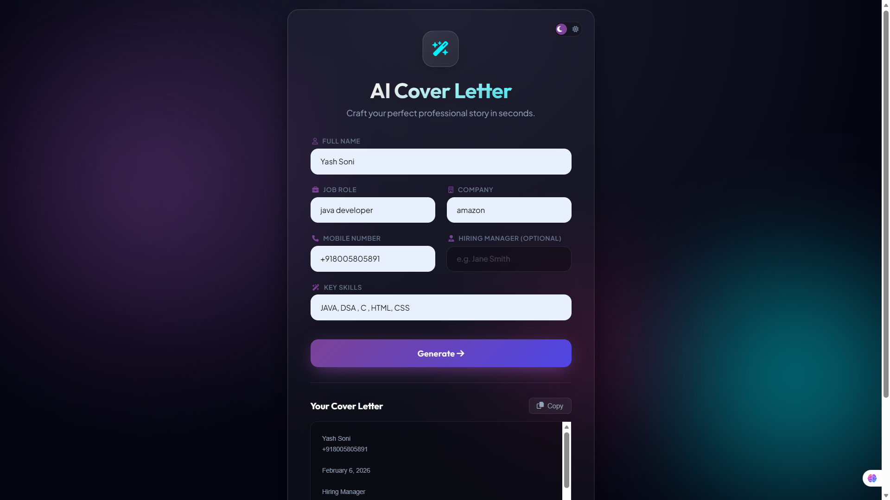

# AI Cover Letter Generator 🚀

An intelligent, professional tool that generates tailored cover letters using Google's Gemini AI. Features a premium "Onyx & Silver" luxury monochrome design.

## 🔗 Live Demo

<!-- Replace '#' with your actual live deployment URL -->

[](https://ai-cover-letter-6fkv.onrender.com/)


## 📸 Screenshots

<!-- Add your screenshots in the 'screenshots' folder or link them directly -->
<div align="center">
  
  <br>
  <em>Main Dashboard</em>
</div>

## ✨ Features

- **🤖 AI-Powered**: Uses Google Gemini 2.5 Flash for high-quality, context-aware writing.
- **🎨 Luxury Design**: "Onyx & Silver" theme for a clean, distraction-free professional experience.
- **⚡ Instant generation**: Fast streaming response.
- **🌓 Dark/Light Mode**: Seamless switcher for any environment.
- **📱 Responsive**: Fully optimized for mobile and desktop.

## 🛠️ Tech Stack

- **Frontend**: HTML5, CSS3 (Glassmorphism), JavaScript (Vanilla)
- **Backend**: Node.js, Express.js
- **AI Engine**: Google Gemini API (`gemini-2.5-flash`)

## 🚀 Getting Started

### Prerequisites

- Node.js installed
- Google Gemini API Key

### Installation

1. **Clone the repository**

   ```bash
   git clone https://github.com/yourusername/ai-cover-letter.git
   cd ai-cover-letter
   ```

2. **Install dependencies**

   ```bash
   npm install
   ```

3. **Set up environment variables**
   Create a `.env` file in the root directory:

   ```env
   GEMINI_API_KEY=your_api_key_here
   ```

4. **Run the server**

   ```bash
   node server.js
   ```

5. **Open in browser**
   Visit `http://localhost:3000`

## 🤝 Contributing

Contributions are welcome! Please feel free to submit a Pull Request.

## 📄 License

This project is licensed under the MIT License.
